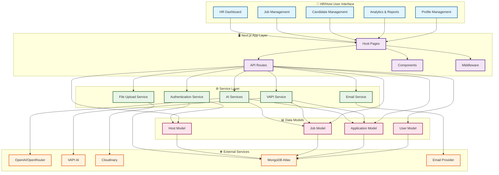
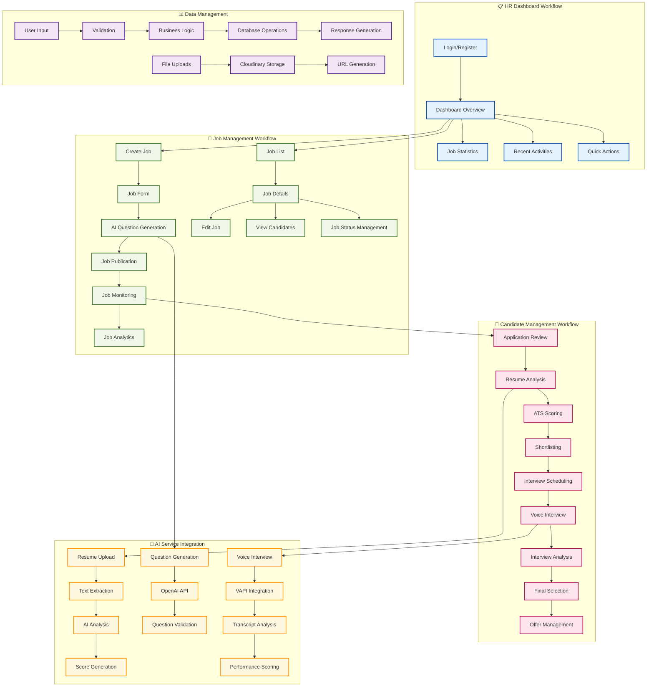
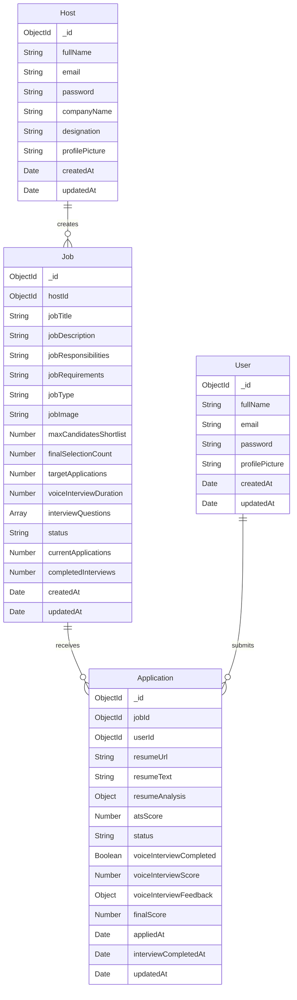

# HR/Host Side Architecture Diagram

## System Architecture



## Detailed Component Architecture



## API Architecture

```mermaid
graph LR
    %% Client Side
    subgraph "🌐 Client Side"
        A[Host Dashboard UI]
        B[Forms & Components]
        C[State Management]
    end

    %% API Layer
    subgraph "🔄 API Layer"
        D[Authentication APIs]
        E[Job Management APIs]
        F[Candidate APIs]
        G[Analytics APIs]
        H[File Upload APIs]
    end

    %% Business Logic
    subgraph "⚡ Business Logic"
        I[Host Authentication]
        J[Job CRUD Operations]
        K[Application Processing]
        L[AI Integration]
        M[Analytics Generation]
    end

    %% Database Layer
    subgraph "💾 Database Layer"
        N[Host Collection]
        O[Jobs Collection]
        P[Applications Collection]
        Q[Users Collection]
    end

    %% External Services
    subgraph "🛠️ External Services"
        R[OpenAI/OpenRouter]
        S[VAPI]
        T[Cloudinary]
        U[Email Service]
    end

    %% API Routes Details
    subgraph "📍 Host API Routes"
        D1[/api/host/auth/login]
        D2[/api/host/auth/register]
        D3[/api/host/auth/logout]
        
        E1[/api/host/jobs/create]
        E2[/api/host/jobs/list]
        E3[/api/host/jobs/[id]/edit]
        E4[/api/host/jobs/[id]/delete]
        E5[/api/host/jobs/[id]/analytics]
        
        F1[/api/host/jobs/[id]/candidates]
        F2[/api/host/jobs/[id]/candidates/shortlist]
        F3[/api/host/jobs/[id]/candidates/offer]
        
        H1[/api/host/update-profile-picture]
    end

    %% Connections
    A --> D
    A --> E
    A --> F
    A --> G
    A --> H
    
    B --> D
    B --> E
    B --> F
    
    C --> D
    C --> E
    C --> F
    
    D --> I
    E --> J
    F --> K
    G --> M
    H --> K
    
    I --> N
    J --> O
    K --> P
    K --> Q
    M --> O
    M --> P
    
    L --> R
    L --> S
    K --> T
    I --> U
    
    D --> D1
    D --> D2
    D --> D3
    E --> E1
    E --> E2
    E --> E3
    E --> E4
    E --> E5
    F --> F1
    F --> F2
    F --> F3
    H --> H1

    %% Styling
    classDef clientLayer fill:#e8f5e8,stroke:#2e7d32,stroke-width:2px
    classDef apiLayer fill:#e3f2fd,stroke:#1976d2,stroke-width:2px
    classDef businessLayer fill:#fff3e0,stroke:#f57c00,stroke-width:2px
    classDef dataLayer fill:#fce4ec,stroke:#c2185b,stroke-width:2px
    classDef externalLayer fill:#f3e5f5,stroke:#7b1fa2,stroke-width:2px
    classDef routeLayer fill:#f1f8e9,stroke:#388e3c,stroke-width:2px

    class A,B,C clientLayer
    class D,E,F,G,H apiLayer
    class I,J,K,L,M businessLayer
    class N,O,P,Q dataLayer
    class R,S,T,U externalLayer
    class D1,D2,D3,E1,E2,E3,E4,E5,F1,F2,F3,H1 routeLayer
```

## Database Schema

